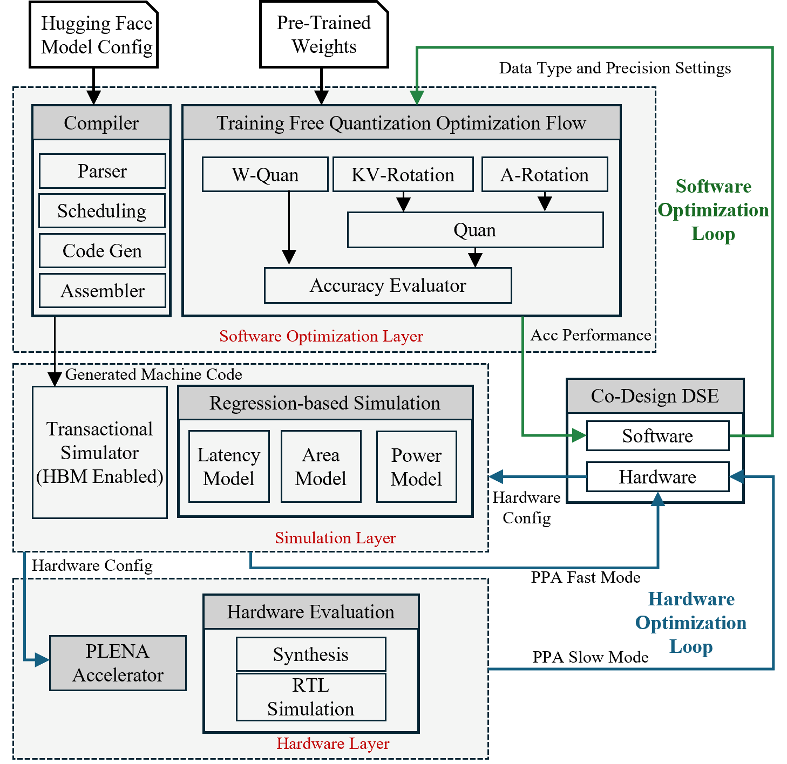

# PLENA Simulation System

<div align="center">
  
</div>

This repository contains the multi-level simulator system for **PLENA (Programmable Long-context Efficient Neural Accelerator)**.

## Overview

The PLENA Simulator provides three main components:

- **Transaction-level Simulator**: Models PLENA's architectural behavior at a high level, enabling rapid exploration of design choices, memory hierarchies, and long-context LLM inference workflows without the overhead of cycle-accurate RTL simulation.
- **Analytical Latency Model**: Provides fast estimation of PLENA's performance characteristics (TTFT, TPS) based on architectural parameters and instruction latencies for specified workloads.
- **Utilization Model**: Analyzes the utilization of the systolic array based on architectural parameters and instruction latencies, computing attainable vs theoretical FLOPS.



---

## PLENA Publication

If you use this simulator in your research, please cite the following paper:

**Combating the Memory Walls: Optimization Pathways for Long-Context Agentic LLM Inference**  
[arXiv:2509.09505](https://arxiv.org/abs/2509.09505)

```bibtex
@misc{wu2025combatingmemorywallsoptimization,
  title        = {Combating the Memory Walls: Optimization Pathways for Long-Context Agentic LLM Inference},
  author       = {Haoran Wu and Can Xiao and Jiayi Nie and Xuan Guo and Binglei Lou and Jeffrey T. H. Wong and Zhiwen Mo and Cheng Zhang and Przemyslaw Forys and Wayne Luk and Hongxiang Fan and Jianyi Cheng and Timothy M. Jones and Rika Antonova and Robert Mullins and Aaron Zhao},
  year         = {2025},
  eprint       = {2509.09505},
  archivePrefix= {arXiv},
  primaryClass = {cs.AR},
  url          = {https://arxiv.org/abs/2509.09505}
}
```

---

## Setup

There are two ways to get a working environment. **Option A (Docker)** is the
recommended path — you only need Docker installed, and it wraps the full toolchain
in a reproducible container. **Option B (Nix)** runs directly on your machine if you
prefer native development.

### Option A — Docker (recommended)

You only need Docker installed (no Nix or direnv on the host). All commands run from
the repository root. Your working tree is bind-mounted into the container at
`/workspace`, so edits on the host are picked up live and build artifacts persist
on the host.

**Prerequisites:**

- Docker Engine with the Compose plugin (`docker compose`)
- (Optional) NVIDIA Container Toolkit for CUDA support

**Build the image and open a shell:**

```bash
git submodule update --init --recursive   # once, on the host
just docker-dev
```

**Run a test directly (no interactive shell needed):**

```bash
just docker-test test-aten-linear            # run a just recipe in Docker
just docker-test test-aten-linear --mlen 128 # ...with args
```

The first emulator test compiles the Rust binary automatically (one-time, a few
minutes); it persists on the host and later runs reuse it.

**Common Docker commands** (see [`docker/README.md`](docker/README.md) for the full list):

| Command | Description |
|---------|-------------|
| `just docker-dev` | Build, start, and enter the dev container |
| `just docker-run <cmd>` | Run a command in the dev environment |
| `just docker-test <recipe> [args...]` | Run a `just` recipe in Docker |
| `just docker-down` | Stop containers |

**CUDA support:**

```bash
docker compose -f docker/docker-compose.yml --profile cuda up -d dev-cuda
docker compose -f docker/docker-compose.yml exec dev-cuda bash
```

> **Note:** The repository is bind-mounted from the host (owned by your host user)
> while the container runs as `root`. The image marks `/workspace` as a git
> `safe.directory` so Nix's flake evaluation doesn't fail with a dubious-ownership
> error. If you build a custom image, preserve that setting.

### Option B — Nix (native)

**Prerequisites:**

- `nix` package manager (with flakes enabled)
- `direnv` for environment management

```bash
# Install direnv hook in your shell
echo 'eval "$(direnv hook bash)"' >> ~/.bashrc
source ~/.bashrc
```

**Installation:**

```bash
# Allow direnv to load the environment
direnv allow

# Enter the development environment
nix develop

# Update git submodules
git submodule update --remote --merge
```

You are now in a shell with the full toolchain (Rust, Python 3.12, clang, cmake,
etc.) and can run any of the `just` commands below directly.

---

## Configuration

The simulator and emulator both use `plena_settings.toml` as the main configuration file for hardware parameters. This file contains:

- Hardware dimensions (MLEN, BLEN, VLEN, HLEN)
- Memory configuration (HBM, SRAM sizes)
- Instruction latencies
- Prefetch/writeback amounts

The configuration file supports two modes:
- `analytic`: Used by analytical models (latency and utilization)
- `transactional`: Used by the transaction-level emulator

Set the active mode in the `[MODE]` section of `plena_settings.toml`.

---

## Transaction-level Emulation

The transaction-level emulator executes machine code instructions sequentially, modeling PLENA's behavior at a high abstraction level. It includes:

- HBM/DRAM off-chip memory simulation
- Handwritten assembly templates for every operator in PLENA ISA for LLaMA
- Test scripts to verify correctness of assembly templates

The emulator reads hardware configuration from `plena_settings.toml` (using the `behavior` mode).

### Running Simulations

**Standard mode:**
```bash
just build-emulator [task]
# Example: just build-behave-sim linear
```

**Debug mode:**
```bash
just build-emulator-debug [task]
# Example: just build-behave-sim-debug linear
```

**Run pre-generated assembly:**
```bash
just run-generated-asm
```

**Quiet mode (latency and error metrics only):**
```bash
just run-generated-asm-quiet
```

---

## Analytical Models

### Latency Model

The latency model provides fast performance estimation for PLENA workloads. It computes:
- **TTFT (Time To First Token)**: Latency for the prefill phase
- **TPS (Tokens Per Second)**: Throughput for the decode phase

#### Available Commands

**List available models:**
```bash
just latency-list-models
```

**Run with default settings** (llama-3.1-8b, batch=4, input=2048, output=1024):
```bash
just latency llama-3.1-8b
```

**Run with custom batch size:**
```bash
just latency-batch llama-3.1-8b 8
```

**Run with full custom parameters:**
```bash
just latency-full llama-3.1-8b 4 2048 1024
# Format: just latency-full {model} {batch} {input_seq} {output_seq}
```

**Get JSON output:**
```bash
just latency-json llama-3.1-8b
```

## Project Structure

```
PLENA_Simulator/
├── transactional_emulator/    # Transaction-level simulator (Rust)
├── analytic_models/          # Analytical models (Python)
│   ├── latency/             # Latency estimation model
│   └── utilisation/         # Utilization analysis model
├── compiler/                # Compiler and model definitions
├── PLENA_Tools/             # Supporting tools and utilities (submodule)
├── doc/                     # Documentation and diagrams
├── plena_settings.toml      # Main configuration file
└── justfile                 # Command shortcuts
```
