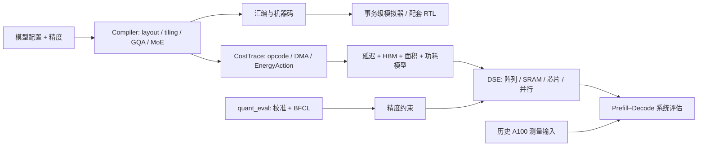

# PLENA Software

面向长上下文 LLM Prefill 的编译、模拟、量化与系统设计空间搜索工程。输入 Qwen3 Dense/MoE 的形状、精度和硬件配置，输出计算/DMA 指令、成本 trace、延迟/面积/功耗估计及 Prefill–Decode 系统指标。

本仓库完整收录 PLENA 的研究模拟器与 Qwen3 量化软件分支，核心依赖直接内嵌。配套硬件：[plena-hardware](https://github.com/Sanssssssssssssssss/plena-hardware)。上游来源、版本差异和本仓库改动见 [PROVENANCE](PROVENANCE.md)。

## 架构与源码



| 目录 | 主要输入 → 输出 |
|---|---|
| [PLENA_Simulator/PLENA_Compiler](PLENA_Simulator/PLENA_Compiler) | 张量形状与硬件配置 → layout、schedule、汇编、CostTrace |
| [PLENA_Simulator/PLENA_Tools](PLENA_Simulator/PLENA_Tools) | 精度/存储配置 → MX 数值工具、镜像、结果比较 |
| [analytic_models](PLENA_Simulator/analytic_models) | 指令与访存工作量、校准系数 → 延迟、面积、能耗 |
| [transactional_emulator](PLENA_Simulator/transactional_emulator) | 机器码与初始内存 → Rust 事务级执行及内存状态 |
| [Workspace](PLENA_Simulator/Workspace) | 实验脚本、历史项目记录、已有校准与精度汇总 |
| [PLENA_Software](PLENA_Software) | PyTorch Qwen3 Dense/MoE、量化配置 → 校准、BFCL 与 PPL 结果 |
| [quant_eval](PLENA_Software/quant_eval) / [prefill_DSE](PLENA_Software/prefill_DSE) | 模型与精度候选 → 评估与可恢复的批量搜索；OSWorld 源码已内嵌 |
| [官方文档](docs/upstream/PLENA_Doc) / [阅读索引](docs/READING.md) | 体系说明与实际代码入口 |
| [scripts](scripts) / [evidence](evidence) | 本仓库运行入口 / 带来源的历史及当前收据 |

## 安装与最小运行

Python 3.12，CPU 即可。不下载模型权重。以下在仓库根目录执行：

```powershell
git clone https://github.com/Sanssssssssssssssss/plena-software.git
cd plena-software
uv venv --python 3.12
uv pip install --python .venv/Scripts/python.exe -r requirements-cpu.txt --index-strategy unsafe-best-match
.venv/Scripts/python.exe scripts/run_cpu.py
.venv/Scripts/python.exe scripts/audit_evidence.py
```

Linux 使用 `.venv/bin/python`。uv 的两个索引分别是 PyPI 与 PyTorch 官方 CPU 源；也可用 `python -m pip install -r requirements-cpu.txt`。运行入口自行定位仓库并设置组件导入路径。

`run_cpu.py` 依次执行：5 种 tile 的 GQA online-attention 数学对照、完整立即数测试、研究前端/系统指标/跨阶段空闲能耗 3 项检查、小型 v5/R1/R4 编译 A/B。日志与 JSON 写入 `runs/`，失败返回非零。预期 tiny 动态指令为 **14,966 / 14,518 / 13,510**，同时检查矩阵算术次数一致；这不是周期加速比。

[本轮验收及日志](docs/VALIDATION.md)记录实际结果。再次运行会更新自己的 `runs/` 文件，正式实验应另存带配置的结果目录。

量化/GPU 环境与事务级模拟器的完整入口见 [SETUP](docs/SETUP.md)。本轮未重跑 GPU、完整 DSE 或 DC。部分作者原始配置/结果缺失，不能只执行默认命令就声称复现历史论文成绩。

## 与硬件配套

研究模拟器 `fddfcb9a` + Compiler `0ba3b657`；Tools 原 pin `a359963d` 缺失，采用 `0f103539` 和局部旧包名别名。量化分支 `d8c9bbcb`。具体版本、接口文件和未验证组合见 [配套表](docs/COMPATIBILITY.md)。跨仓库前先核对 ISA、精度和 tile 配置。

## 四条项目主线

| 主线 | 从哪里理解与复现 |
|---|---|
| 编译映射 | Qwen3 显式 head_dim → GQA/KV 布局 → tile/AGU/MoE 路由 → 指令与 DMA；[代码索引](docs/READING.md) |
| RTL 优化 | m/l 状态驻留、R4 online softmax、packed PV 写回；在配套硬件仓库跑模块测试 |
| 量化与联合搜索 | BFCL 精度约束 + 校准成本模型 + 阵列/SRAM/多芯片候选；[流程拆解](docs/PROJECT_JOURNEY.md) |
| 系统评估 | Prefill/Decode 瓶颈、固定 batch 吞吐、SLO goodput、含等待静态能耗的 tokens/J |

[分阶段学习与瓶颈思路](docs/PROJECT_JOURNEY.md)按照“观察什么 → 怎么判断 → 改哪里 → 用什么验证”组织。[简历数字核对](docs/RESULTS.md)区分作者记录、保存的汇总和本机新测试。

## 结果来源与限制

历史单层模型表可重算 Dense **2.6871×** / MoE **3.2192×**；81,920 为历史 COMPLETE trial 数，原始 trial 库缺失。235B W4/A4/KV4 部分 FP 设置有 **48/50=96%** 汇总，94% 下界尚待同配置证据。

历史系统 v3 表支持吞吐 **+5.292% / +13.254%**；同表重算能效为 **+47.480% / +67.538%**，未与截图的 46.8% / 65.0% 对齐。上述属于原作者模型/测量组合，不是本次硬件实测。完整条件、缺失证据和资源估算见 [RESULTS](docs/RESULTS.md) 与 [资源预算](docs/RESOURCE_BUDGET.md)。
