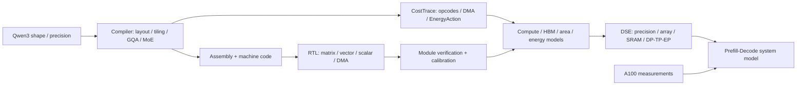

# PLENA Prefill Lab

面向 LLM Prefill 的 NPU 架构、编译与 RTL 学习实验仓库。围绕 **Qwen3 Dense / MoE → 编译映射 → Online Softmax RTL → 成本模型与 DSE → Prefill–Decode 系统评估**，组织源码、中文注释、实验入口和结果证据。

基于 [AICrossSim/PLENA](https://github.com/AICrossSim/PLENA) 及其研究分支。本仓库新增内容是学习编排、核心代码注释、小型实验和证据核对；上游设计与历史研究结果保留来源。版本与归属见 [PROVENANCE.md](PROVENANCE.md)。

**从这里开始**

| 想了解什么 | 入口 |
|---|---|
| 整体架构、数据如何流动 | [架构说明](docs/ARCHITECTURE.md) |
| 简历四项内容对应什么实现、如何讲清楚 | [简历与项目对应](docs/RESUME_MAP.md) |
| 项目怎么一步步做、怎样发现与优化瓶颈 | [分阶段学习路线](study/01_project_journey.md) |
| 应该优先读哪些代码 | [14 个核心文件 / 88 处中文注释](study/core/README.md) |
| 数字怎么计算、有无日志 | [结果证据核对](study/02_numbers_and_evidence.md) |
| 克隆后怎么运行 | [环境与运行说明](docs/SETUP.md) |
| 本机能做多少、完整复现需要多少资源 | [资源预算](study/03_local_runs_and_budget.md) |

**整体结构**



**与项目描述对应的四条主线**

- **编译与算子映射**：显式 head_dim、Packed GQA、分块布局、AGU、MoE dispatch/combine；检查有效工作量、tail 与数值路径。
- **微架构与 RTL**：在线 Softmax 的 m/l/O 递推，多行状态 bank、冲突管理、直接 packed PV 写回；用模块测试检查功能和连续发射。
- **量化与硬件搜索**：把真实 schedule 送入校准的延迟、面积和能耗模型，再在准确率、面积、HBM 与合法配置约束下搜索。
- **系统评估**：区分单层延迟、单批 E2E、请求 TTFT/TPOT、稳态输出 TPS 和 tokens/J；说明瓶颈迁移与空闲能耗。

**已经实际验证的内容** · 2026-10-04

| 实验 | 结果 | 证据 |
|---|---|---|
| 分块 Online Attention vs 完整 reference | 5 种 tile size 通过，float64 最大误差 < 9e-16 | [日志](study/evidence/2026-10-04/online-attention.log) |
| 上游编译器立即数等检查 | 26 tests PASS | [日志](study/evidence/2026-10-04/compiler-large-immediate.log) |
| 小 Linear 生成 | 158 条机器码及 golden | [收据](study/evidence/2026-10-04/cpu-receipt.json) |
| 研究编译前端与系统指标 | 3 tests PASS | [日志](study/evidence/2026-10-04/prefill-checks.log) |
| tiny 编译 A/B | v5 14,966 → v6-R4 13,510 条动态指令；固定 shape 的矩阵算术次数一致 | [结果](study/evidence/2026-10-04/tiny-trace-ab.json) |
| R4 Softmax RTL，VLEN8 / E5M6 | 2 tests PASS | [日志](study/evidence/2026-10-04/rtl-softmax.log)、[XML](study/evidence/2026-10-04/rtl-softmax-results.xml) |

动态指令数改善还没有换算成延迟；模块通过也不等于 full-core 完整工作负载通过。

发布前另用全新克隆和独立 Windows Python 环境复跑了 CPU/研究入口，并重新验证 RTL 启动脚本。见[克隆与运行验证记录](study/evidence/2026-10-04/publication-check.json)。

**项目描述中的数字**

| 数字 | 已核对到的范围 |
|---|---|
| 单层 2.69× / 3.22× | 可由作者历史 A/B 表重算，属于校准架构模型结果 |
| 约 8.2 万方案 | 历史记录的 5 × 16,384 COMPLETE；完整 trial 数据库缺失 |
| W4/A4/KV4 的 94%–96% | 235B 有 48/50=96% 汇总；94% 下界未对齐同版本证据 |
| 输出吞吐 +5.3% / +13.3% | 可从历史系统组合表重算，属于解析组合 |
| 输出能效 +46.8% / +65.0% | 当前找到的 v3 表为 +47.48% / +67.54%；最终同版本报告待补 |

详见[数字与证据](study/02_numbers_and_evidence.md)。研究 Tools 原锁定 commit 不可获得，当前 focused checks 使用显式替代版本；完整 DSE/GPU 复现还缺部分配置与原始日志。

**快速开始** · Python 3.12，CPU 实验无需模型权重

```powershell
git clone https://github.com/Sanssssssssssssssss/plena-prefill-lab.git
cd plena-prefill-lab
python study/bootstrap.py
python -m venv .venv
.venv\Scripts\python.exe -m pip install -r requirements.txt
.venv\Scripts\python.exe study/run_cpu.py
.\study\run_prefill_checks.ps1
.venv\Scripts\python.exe study/trace_experiment.py
```

Linux 与 RTL 仿真入口见 [SETUP.md](docs/SETUP.md)。按上面的 bootstrap 获取依赖；研究分支的原 Tools pin 缺失，直接对所有目录递归初始化会在该依赖处失败。

**目录**

```text
docs/                         架构、简历对应、环境说明
study/core/                   加注释的核心阅读副本
study/evidence/2026-10-04/     固定实验记录、历史 XML、来源与哈希
study/*.py, *.ps1, *.sh       数学、编译、RTL 和证据核对入口
lab/rtl-prefill/              RTL 快照的 tracked 源码与当时 Compiler/Tools
lab/python-aliases/           研究 Tools 的局部导入兼容
PLENA/                       官方主仓库的固定版本引用
PLENA-Prefill/                Prefill 研究分支的固定版本引用
PLENA_Doc/                    官方文档的固定版本引用
```

大压缩包、虚拟环境、构建缓存与可再生成产物留在本机。历史证据固定在 `study/evidence`；新实验写入忽略的 `study/logs` 和 `study/runs`。
