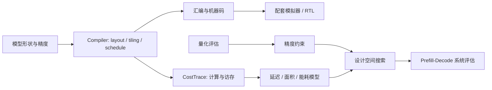

# PLENA Software · Qwen3 Prefill

**Llama → Qwen3-32B / 235B-A22B · 编译映射 · 量化与架构联合优化**

将 [PLENA](https://github.com/AICrossSim/PLENA) 面向 Llama 的编译与评估流程扩展到 Qwen3-32B（Dense）和 Qwen3-235B-A22B（MoE）的长上下文 Prefill。适配显式 `head_dim`、GQA 布局与专家路由，生成计算/DMA 指令，并结合量化评测和成本模型搜索阵列、SRAM 与多芯片配置。

本仓库保存 Compiler、Simulator、量化评测和 DSE 源码；四行 Online Softmax、状态驻留与 packed PV 的 RTL 在配套硬件仓库。

[硬件工程](https://github.com/Sanssssssssssssssss/plena-hardware) · [核心源码索引](docs/READING.md) · [运行结果与日志](docs/VALIDATION.md) · [安装说明](docs/SETUP.md)

## 项目结果

以下采用项目最终报告口径，主要实验在另一台计算机完成；本机复测见下方独立章节。

| 指标 | Qwen3-32B / Dense | Qwen3-235B-A22B / MoE |
|---|---:|---:|
| 同精度、同阵列下的单层模型加速 | **2.69×** | **3.22×** |
| 稳态输出吞吐提升 | **5.3%** | **13.3%** |
| 输出能效提升 | **46.8%** | **65.0%** |

联合搜索约 **8.2 万组候选配置**；最终 **W4/A4/KV4** 配置取得 **94%–96% BFCL-Multiple** 准确率。系统评估采用 **90k 输入 / 8k 输出、batch 8**，在匹配硅面积与 HBM 预算下，与纯 A100 基线比较。

单层收益来自模型评估；系统指标结合 NPU 性能模型与 A100/vLLM 测量。项目报告、归档表格及待同步日志的情况见 [RESULTS](docs/RESULTS.md)。

## 架构与源码



| 核心目录 | 输入 → 输出 |
|---|---|
| [Compiler](PLENA_Simulator/PLENA_Compiler) / [Tools](PLENA_Simulator/PLENA_Tools) | shape、精度、硬件配置 → 布局、调度、指令、数值与镜像工具 |
| [analytic_models](PLENA_Simulator/analytic_models) | 指令与访存工作量、校准数据 → 延迟、面积、能耗估计 |
| [transactional_emulator](PLENA_Simulator/transactional_emulator) | 机器码与初始内存 → 事务级执行与内存状态 |
| [quant_eval](PLENA_Software/quant_eval) / [prefill_DSE](PLENA_Software/prefill_DSE) | Qwen3 Dense/MoE、精度候选 → 校准、BFCL/PPL 与批量搜索 |
| [scripts](scripts) / [evidence](evidence) | 可复跑入口 → 日志、结果核对与证据 |

[OSWorld](PLENA_Software/quant_eval/benchmarks/OSWorld) 是**可选第三方桌面 Agent 评测组件**，由量化软件的 OSWorld 评测入口调用。CPU 检查无需运行它。[Workspace](PLENA_Simulator/Workspace) 与[官方文档](docs/upstream/PLENA_Doc)保留上游实验记录及参考说明。

## CPU 最小运行

Python 3.12，在仓库根目录执行：

```powershell
git clone https://github.com/Sanssssssssssssssss/plena-software.git
cd plena-software
uv venv --python 3.12
uv pip install --python .venv/Scripts/python.exe -r requirements-cpu.txt --index-strategy unsafe-best-match
.venv/Scripts/python.exe scripts/run_cpu.py
.venv/Scripts/python.exe scripts/audit_evidence.py
```

Linux 使用 `.venv/bin/python`。运行结果写入 `runs/`；检查失败返回非零。CPU 路径不需要模型权重。量化/GPU 环境与事务级模拟器构建见 [SETUP](docs/SETUP.md)。

## 本机复测

| 路径 | 结果与条件 |
|---|---|
| 数学 reference | GQA online attention，5 种 tile 配置对照 |
| 编译与研究检查 | 26 项编译器检查、3 项研究前端/系统指标检查通过 |
| 小型编译 A/B | v5 / R1 / R4：**14,966 / 14,518 / 13,510** 条动态指令；矩阵算术计数一致 |
| 本仓库新增 | 独立运行脚本、43 处核心源码注释、配套版本说明与结果核对 |

以上为 **2026-10-04 的本机验证结果**。A/B 指令数下降 9.73%；这组测试没有测量端到端延迟。[完整配置与日志](docs/VALIDATION.md) · [日志目录说明](evidence/README.md)。

## 从哪里读代码

| 问题 | 工程入口 |
|---|---|
| 怎样把 GQA/MoE 映射为计算与 DMA？ | [GQA 调度](PLENA_Simulator/PLENA_Compiler/aten/plena/program_attention.py)、[MoE 路由](PLENA_Simulator/PLENA_Compiler/aten/moe.py)与[源码索引](docs/READING.md) |
| 怎样比较优化，排除工作量变化？ | [小型 A/B 的配置和检查器](docs/VALIDATION.md) |
| 精度、阵列、SRAM 与带宽如何相互制约？ | [项目阶段与瓶颈分析](docs/PROJECT_JOURNEY.md) |
| 历史吞吐与能效数字如何计算？ | [研究结果核对](docs/RESULTS.md)与[资源预算](docs/RESOURCE_BUDGET.md) |

## 配套版本与来源

研究路径：Simulator `fddfcb9a`、Compiler `0ba3b657`、量化分支 `d8c9bbcb`。Tools 原 pin 缺失，使用 `0f103539` 及兼容别名。跨仓库运行前核对 ISA、精度和 tile，见[版本配套表](docs/COMPATIBILITY.md)。

PLENA 基础框架及第三方组件保留原有版权声明。仓库整理另补充中文注释、运行脚本和结果核对。[来源与改动](PROVENANCE.md)记录导入版本、逐文件哈希及适用许可证。GPU、完整 DSE、DC 综合和 Rust 事务级执行未包含在上述本机验证中。
