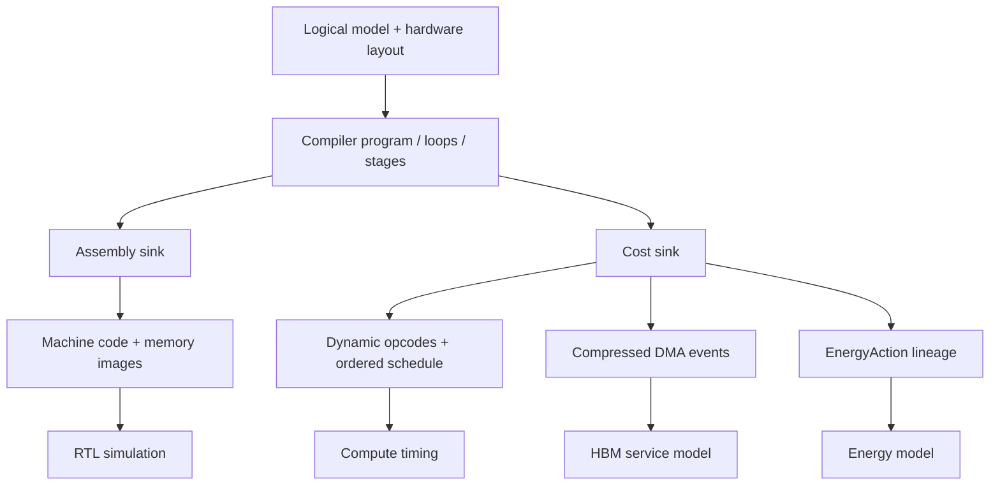
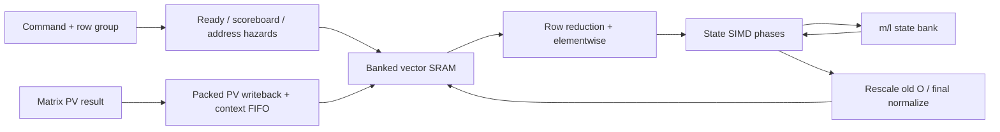

# Architecture · 模型、编译、RTL 与系统评估

核心是让模型张量、编译器实际生成的工作、硬件执行代价和最终系统指标使用一致的语义。先沿数据流读，再讨论优化。

**模型与布局**

Qwen3-32B 使用 hidden=5120、Q heads=64、KV heads=8、head_dim=128；Q 投影宽度为 8192，K/V 各为 1024。235B-A22B 的 Q/KV heads=64/4，GQA 比例为 16；MoE 还需要 token 到 expert 的路由计划。

编译器将 `[B,S,H]` 输入映射到阵列、SRAM 与 HBM 的物理布局。MLEN/BLEN/VLEN 决定 tile；逻辑 head 数、物理 broadcast 宽度和填充是不同的量。读 [Packed GQA](../study/core/02_packed_gqa_schedule.py) 与 [MoE](../study/core/14_moe_routing.py)。阵列空槽、padding 和重复 KV 搬运分别对应打包、tail 处理和 KV 驻留策略。

**一个 schedule，两类输出**

小 Linear 入口使用模板路径；研究采用 ATen 风格的 program builder/emitter。CostTrace 保留动态循环、阶段、DMA 和能耗动作。静态指令数决定代码体积；动态指令数记录工作次数；周期还取决于流水、依赖和 DMA。

AGU 可省去满足依赖条件的循环尾地址更新，但 setup 成本和编码范围决定是否值得使用。读 [Linear](../study/core/01_linear_workload.py)、[CostTrace](../study/core/03_cost_trace.py)、[AGU](../study/core/13_agu.py)；运行 [tiny A/B](../study/trace_experiment.py)。

**RTL 的执行分工**

| 单元 | 工作 | 主要限制 |
|---|---|---|
| Frontend/control | 取指、解码、循环、依赖与停顿 | 指令、数据就绪及资源冲突 |
| Matrix machine | Linear、QK、PV、FFN/MoE | 阵列形状、填充、操作数供给 |
| Vector machine | elementwise、规约、Softmax | 规约宽度、状态流量、行间并行 |
| Scalar/AGU | 地址、控制、标量计算 | 更新次数、立即数、依赖 |
| SRAM/HBM/DMA | tile 驻留、搬入搬出 | 端口、bank、burst、容量、复用 |

top 的概念链为 instruction memory → decoder/control → matrix/vector/scalar → SRAM/HBM。原模块在 [lab/rtl-prefill/src](../lab/rtl-prefill/src)，主线阅读入口是 [study/core](../study/core/README.md)。

**Online Softmax：递推状态与四行并行**

每个 query 行依次处理 key blocks，保存 m（已见最大分数）、l（指数和）、O（未归一化输出）。新块使 m 增大时，用 `exp(m_old-m_new)` 同时缩放旧 l 和 O，最后计算 O/l。

state bank 降低通用标量路径的状态搬运；direct packed PV 减少 shift/add；R-way engine 并行独立 query 行。scoreboard 保护在途地址依赖，上下文 FIFO 保护返回结果与请求的对应关系。`valid && ready` 才是接收，II=1 不表示依赖链一拍完成。

读核心 04–09。本次 R4/VLEN8/E5M6 仿真覆盖尾行、状态递推、最终缩放与连续发射；未跑 full-core workload。R16 在研究中属于结构外推。

**成本与 DSE**

Compute 使用架构 timing；HBM 根据生产 DMA 的通道/bank/row 特征校准；面积计入逻辑结构与 SRAM macro 铺排；能耗由动作计数、校准系数和静态/背景项组成。

DSE 最小化 prefill latency 与 energy，准确率、面积、HBM 容量和合法配置作为约束。DP/TP/EP 需要重新计算 rank-local shape、权重复制与通信。读[能耗](../study/core/11_system_power.py)和[DSE objective](../study/core/12_dse_objective.py)。大阵列外推、理想 II、clock gating 与 SRAM leakage 假设应跟随每个结果。

**系统指标与瓶颈迁移**

同一批串行经过 prefill、KV handoff、decode；不同批次才可跨阶段重叠。稳态 interval 是三阶段耗时的最大值，output TPS 为 `B × output_tokens / interval`。能量还包含快阶段等待时的 idle power。

读[系统指标](../study/core/10_system_metrics.py)。decode 已成为瓶颈后，继续加速 prefill 未必增加 TPS。单批 E2E、TTFT、TPOT 和稳态 TPS 分别报告。历史系统结果是 A100 数据与 NPU 模型组合，当前证据不含真实 KV 导入、排队或 continuous batching 系统测量。

阅读验收：拿一个 tile，解释逻辑 shape、物理存储、搬运/计算指令、跨块状态、停顿条件、CostTrace 计数以及最终受影响的指标。
