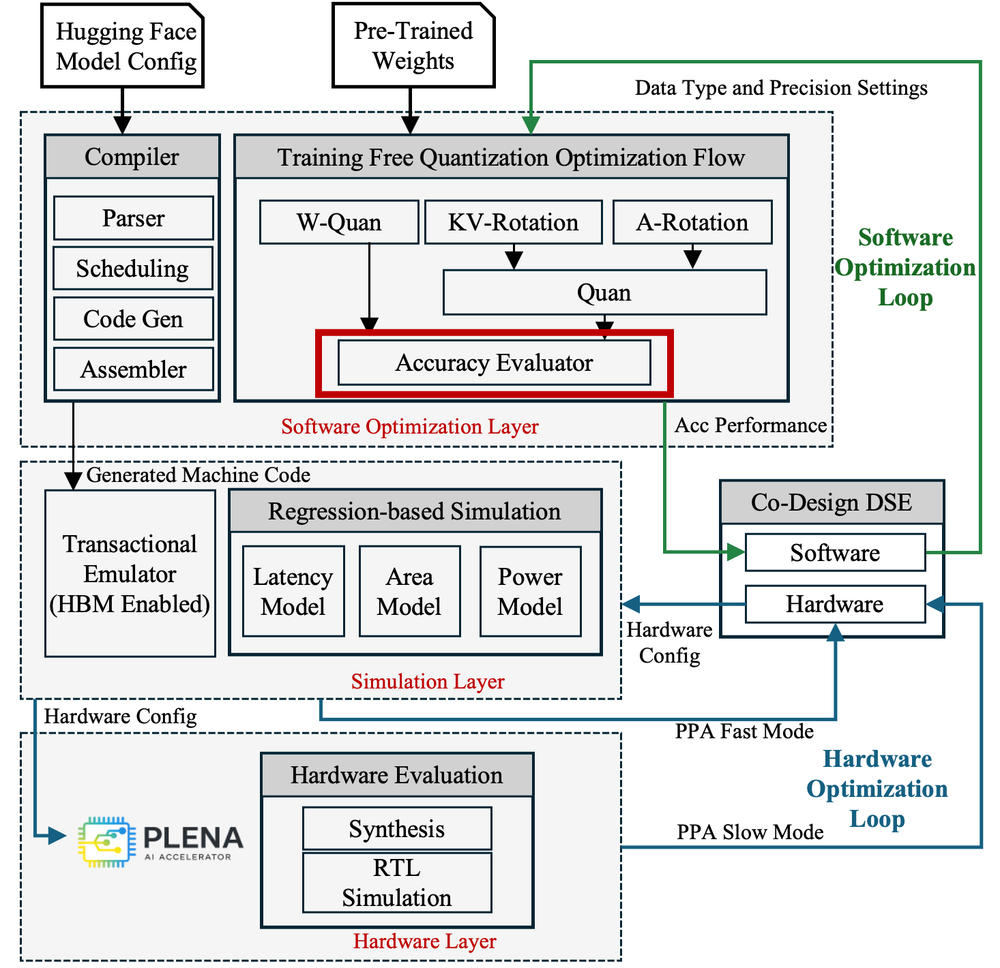
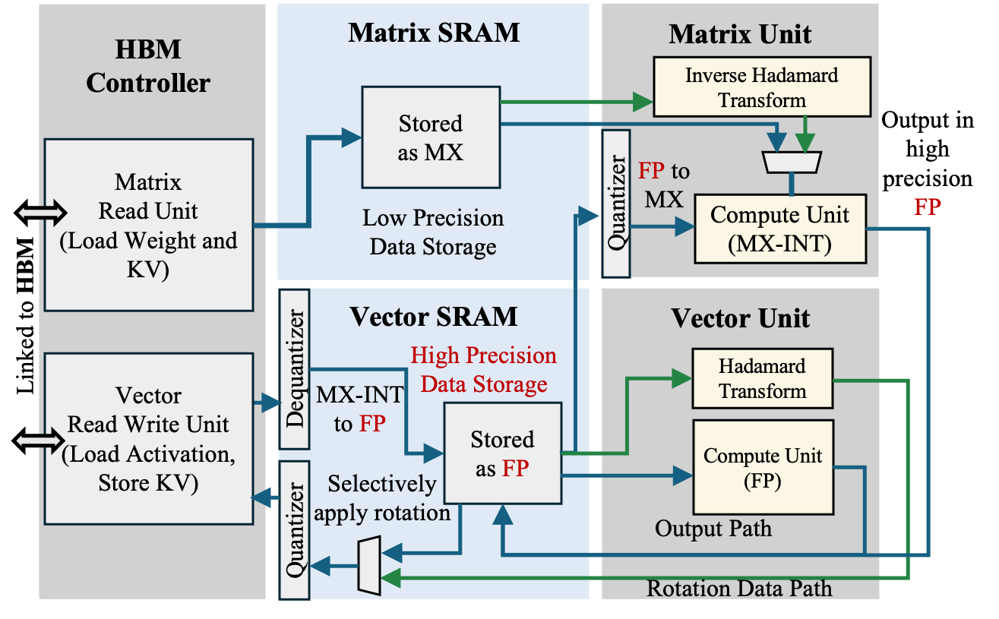

# Quantization and Accuracy Evaluation

  
  
<em>The Accuracy Evaluator within the PLENA toolchain.</em>

## Quantization Methods

PLENA uses post-training quantization (PTQ) based on the Microscaling (MX) data format to compress weights, activations, and the KV cache without retraining. An MX block is a group of elements that share a single scale factor; each block is defined by a tuple (datatype, bit-width, block size *B*). For example, `MXINT4` with *B* = 16 packs 16 values into 4-bit integers under one shared scale, while `MXFP4` with the same block size uses a 4-bit floating-point encoding instead.

PLENA's quantization pipeline applies three targeted optimizations on top of the base MX format:

- **Optimized block-wise clipping (weights)** — Instead of using the block maximum as the clipping threshold, PLENA sweeps a per-block clipping percentile and selects the value that minimizes the output-norm error of each block. This is integrated into the GPTQ iterative weight-update loop so that clipping and rounding errors are compensated together. MXINT is the default format for weight quantization.
- **Selective rotation (activations and KV cache)** — A Hadamard rotation is applied to suppress outlier channels that would otherwise degrade low-bit representations. Rotation is beneficial for activations and KV cache values but can hurt weight-only quantization, so PLENA applies it selectively: activations and KV cache tensors are rotated before quantization, while weights are not.
- **Asymmetric mixed precision** — Weights, activations, and the KV cache can each be assigned independent MX formats and bit widths (e.g., MXINT8 weights with MXFP4 activations), enabling the co-design loop to trade precision per tensor class against area and latency.

These choices are exposed to the rest of the system through the TOML precision configuration, which specifies the format, bit width, and block size for each tensor class.

## Accuracy Evaluator

The Accuracy Evaluator measures how PLENA's quantization choices affect model quality on real workloads. Given a target model and a precision configuration (weight / activation / KV-cache formats, bit widths, scale granularity), it runs the model on a specified workload and reports task accuracy, so the co-design loop can trade precision for area and latency without silently degrading model quality.

It lives in the [`PLENA_Software`](https://github.com/AICrossSim/PLENA_Software) repository.

## What It Evaluates

- **Quantization fidelity** — Simulates PLENA's on-device numerics (MXFP / MXINT / FP formats with configurable mantissa, exponent, and shared-scale granularity) applied to weights, activations, and the KV cache.
- **Asymmetric mixed precision** — Supports independent precision settings per tensor class, matching the full PLENA design space.
- **Workload-driven scoring** — Runs the quantized model on the workload specified by the user (e.g. long-context LLM inference tasks) and reports the corresponding task metric.

## Interface

The co-design layer queries the evaluator through:

- **`get_accuracy()`** in `co_design/interface/interface.py` — Accepts a precision configuration, invokes `PLENA_Software` to run the workload under that configuration, and returns the resulting accuracy metric for use as an optimization objective.

Precision settings are parsed from the active TOML configuration via `parse_precision_config()` and `get_bit_width()` in `co_design/interface/utils.py`, then passed through to `PLENA_Software` before each evaluation.
