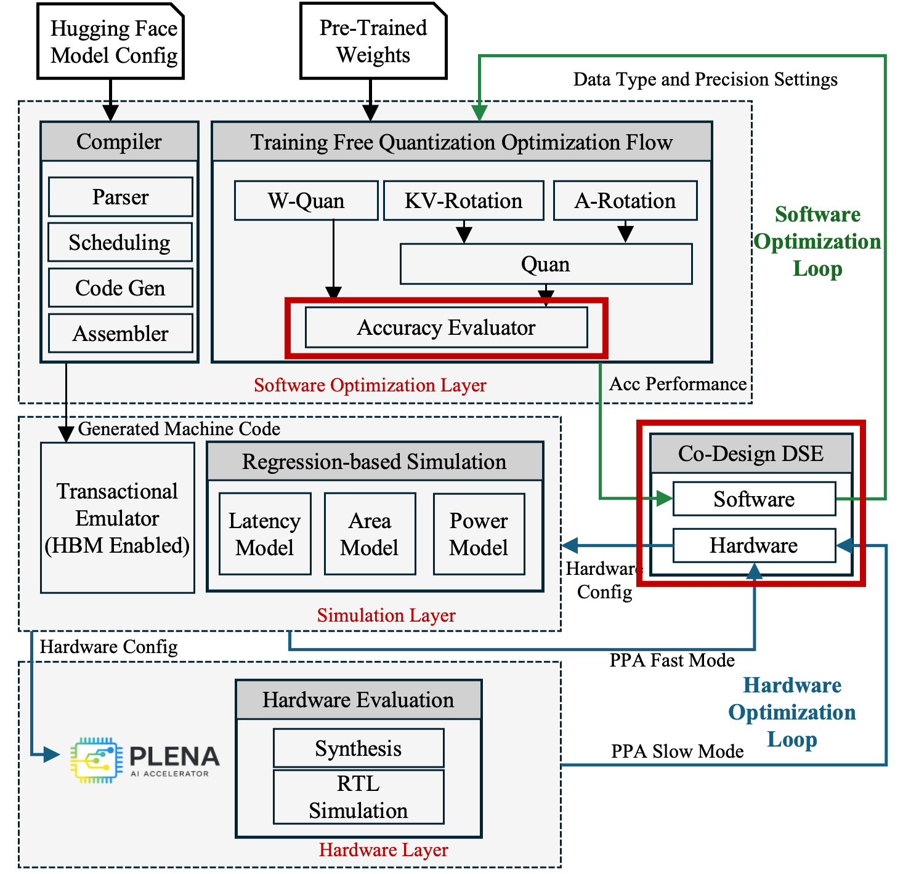

# Co-Design

  
  
<em>The Co-Design DSE within the PLENA toolchain.</em>

## System Co-Design Exploration

The PLENA accelerator's architectural design space spans compute array
dimensions, multi-tier memory configurations (3D-stacked SRAM, HBM, and other
off-chip technologies), quantization precision, and software strategies — see
the [Design Space](design_space.md) page for the full parameter table. The
cross-product of these parameters yields on the order of **10⁶ candidate
configurations**, making exhaustive search infeasible.

We frame co-design as a **multi-objective design space exploration** that
simultaneously maximizes inference throughput and minimizes power under a total
system cost constraint. Each candidate is evaluated by invoking the full
[Analytic Model](analytic_model.md) stack, and the goal is to approximate the
true Pareto frontier within a limited evaluation budget.

## Multi-Objective Bayesian Optimization

Because every evaluation is expensive, naive grid or random search is
impractical. PLENA uses **Multi-Objective Bayesian Optimization (MOBO)**, which
maintains a probabilistic surrogate of each objective and uses it to choose the
next configuration to evaluate.

The optimization runs in two phases:

- **Initialization.** `N_init = 20` configurations are drawn via Sobol
  quasi-random sequences to give broad coverage of the design space, and their
  objectives are evaluated to seed the dataset.
- **Iterative phase.** Until the budget `N_total = 100` is exhausted, the
  optimizer repeats three steps:
    1. **Surrogate fitting** — fit independent Gaussian Process (GP)
       surrogates to the observations, with kernel hyperparameters tuned by
       maximum likelihood.
    2. **Acquisition maximization** — score a random subset of unevaluated
       configurations with the EHVI acquisition function and pick the
       highest-scoring candidate.
    3. **Evaluation** — evaluate the chosen configuration with the analytic
       model and add it to the dataset.

By directing evaluations toward regions of high expected improvement, MOBO
converges to a high-quality Pareto frontier within a small evaluation budget,
exposing favorable throughput–power trade-offs across diverse LLM workloads.

### Gaussian Process Surrogate

Each objective is modeled independently with a **Gaussian Process**, a
non-parametric probabilistic model that produces, for any candidate, a
predictive mean (the estimated objective value) and a predictive variance
(model uncertainty). Variance is higher far from observed points, which
naturally balances **exploitation** of promising regions with **exploration**
of uncertain ones.

### Expected Hypervolume Improvement (EHVI)

PLENA adopts **Expected Hypervolume Improvement** as the acquisition function.
Dominated hypervolume is the only unary Pareto-quality indicator that is
strictly monotone with respect to Pareto dominance, so maximizing it provably
improves the Pareto front.

Given the current Pareto set \(\mathcal{P}_t\) and a reference point
\(\mathbf{r}\), the dominated hypervolume is:

\[
  \mathrm{HV}(\mathcal{P}_t, \mathbf{r})
  = \mathrm{Vol}\bigl(\{\mathbf{y} \in \mathbb{R}^M \mid
    \exists\, \mathbf{x} \in \mathcal{P}_t : \mathbf{f}(\mathbf{x}) \preceq \mathbf{y} \preceq \mathbf{r}\}\bigr).
\]

EHVI is the expected increase in this hypervolume if candidate \(\mathbf{x}\)
were evaluated, integrating over the GP posterior:

\[
  \alpha_{\mathrm{EHVI}}(\mathbf{x})
  = \mathbb{E}\bigl[\mathrm{HV}(\mathcal{P}_t \cup \{\mathbf{x}\}, \mathbf{r})
    - \mathrm{HV}(\mathcal{P}_t, \mathbf{r}) \mid \mathcal{D}_t\bigr].
\]