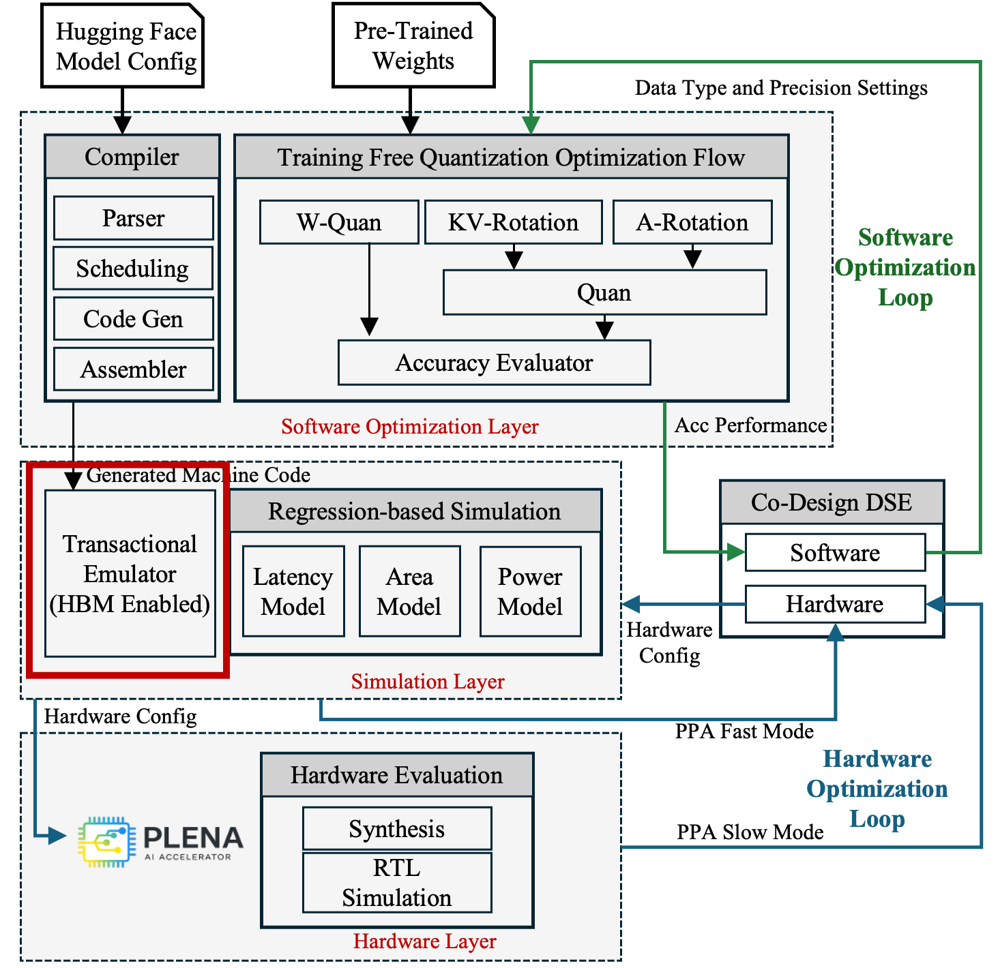

# Transactional Emulator

  
  
<em>The Transactional Simulator within the PLENA toolchain.</em>

To evaluate architectural trade-offs, we developed a transaction-level (cycle-approximate) emulator in Rust that executes the generated machine code in an event-driven manner. The emulator models compute execution, instruction scheduling, and memory transactions at cycle granularity. It is integrated with [Ramulator](https://github.com/CMU-SAFARI/ramulator) and [DRAMSys](https://github.com/tukl-msd/DRAMSys) to provide detailed off-chip memory timing and bandwidth modeling, including bank-level behavior. This enables quantitative analysis of memory–compute interaction, which is critical because memory bandwidth constitutes a primary bottleneck in long-context LLM inference.

The emulator supports the full PLENA architectural design space, including asymmetric mixed-precision arithmetic. By bridging analytic modeling and RTL simulation, it enables accurate evaluation of architectural mechanisms — such as flattened systolic mapping and on-chip FlashAttention — while remaining significantly faster than RTL simulation. We plan to open-source this emulator to facilitate research on LLM accelerator architectures.

## What It Models

- **Event-driven execution** of the generated PLENA machine code at cycle granularity.
- **Compute execution and instruction scheduling** across M-type, V-type, S-type, H-type, and C-type instructions.
- **On-chip memory transactions** against Matrix SRAM, Vector SRAM, Integer SRAM, and FP SRAM, including alignment constraints.
- **Off-chip HBM timing and bandwidth** via Ramulator / DRAMSys, capturing bank-level behavior for `H_PREFETCH_M`, `H_PREFETCH_V`, and `H_STORE_V` transactions.
- **Asymmetric mixed-precision arithmetic** across weights, activations, and KV cache, matching the full PLENA design space.
- **Architectural mechanisms** unique to PLENA, including flattened systolic mapping and on-chip FlashAttention.

## Positioning

The transactional emulator sits between two other evaluation layers:

- **Faster than RTL simulation** — cycle-approximate rather than cycle-accurate, so it scales to realistic LLM workloads.
- **More accurate than the analytic model** — captures memory–compute interaction and bank-level DRAM effects that closed-form cost models cannot represent.

This makes it the right tool for quantitative trade-off studies where memory bandwidth is the dominant bottleneck, as in long-context LLM inference.