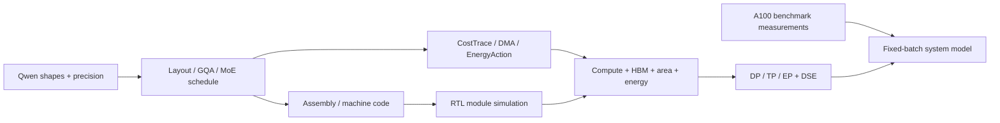

**从能跑一个算子，到能够解释整个研究项目**

这里按依赖关系组织学习。真实开发历史来自[研究分支的项目记录](https://github.com/AICrossSim/PLENA_Simulator/blob/fddfcb9a7c3eaa1ad9f1c24da829a4422b324650/Workspace/final_thesis_complete_project_history_20260818.md)，其中日期与成果属于作者记录；下面的练习是你现在能亲手完成的工作。

整条路径是：模型配置/精度 → 张量布局与分块 → 编译 schedule → 指令、DMA、EnergyAction → 延迟/面积/能耗估计 → 多芯片与 DSE → A100 测量数据 → Prefill–Decode 系统组合。RTL 模块测试和综合校准分别约束功能与成本模型。

**阶段 0：先固定你讨论的是哪个版本**

主仓库负责系统入口；截图所述 Prefill 优化主要位于 Simulator 的研究分支和 RTL 快照。压缩包名的 20260924 是打包标签，里面 RTL HEAD 的提交日期是 8 月 22 日。研究分支 9 月 24 日又修正过系统组合；截图写的 3–7 月不能自动代表这些后续改动的完成时间。

先看[版本与证据收据](evidence/2026-10-04/evidence-audit.json)。自己写下四个标识：Simulator commit、Compiler commit、RTL commit、配置文件。以后每张图都应能回到这四项。

验收：说清 main、Prefill 分支、RTL 快照三者的职责，并知道 Tools 锁定版本目前缺失。读代码前把这个范围固定，否则容易用旧模型解释新结果。

**阶段 1：建立最小的功能闭环**

观察：一个 Linear 不仅需要矩阵乘法，还需要量化、排布、HBM 镜像、DMA 和写回。先读[01_linear_workload.py](core/01_linear_workload.py)。

思考：若 RTL 数值不对，是数学错、舍入不同、地址错，还是写回布局错？必须有一个能逐项检查的小例子。

行动：运行 `study/run_cpu.py`。当前小例子为 `(4,16) @ (16,32)`，固定种子；输出在`study/runs/linear/`（运行后生成）。顺着生成器读入参、quantize、golden、存储、汇编和机器码。这个入口采用模板编译路径，后续研究使用 ATen 风格的 schedule 路径，两者需要分别理解。

应看到：158 条 32-bit 机器码及 golden。生成 golden 只证明 reference 路径可执行，RTL 正确性还需要仿真比较。当前本地没有把这个 Linear 跑到完整 core RTL 验收。

练习：先预测把 N 翻倍会改变哪些权重/输出数据和循环次数，再另设输出目录运行。保持合法 tile 对齐；不通过时先核对 shape，不要直接删除 assert。

**阶段 2：把 Qwen3 的真实形状映射到阵列**

观察：Qwen3-32B 是 hidden=5120、64 个 Q heads、8 个 KV heads、head_dim=128，因此 Q 投影宽 8192、K/V 各宽 1024。不能用 `hidden_size / num_heads = 80` 替代显式 head_dim。主仓库旧解析入口恰有这个限制，所以它只用作安装 smoke。

思考：GQA 的 KV 头少，如果先扩展到全部 Q heads 再照搬布局，可能浪费阵列槽位和搬运；逻辑 KV 数、物理广播宽度、head tail 必须分别描述。

行动：读[PackedGQASchedule](core/02_packed_gqa_schedule.py)和[native_layout.py](https://github.com/AICrossSim/PLENA_Compiler/blob/0ba3b657725bf083feec06c8e356e2d6235cd4d5/aten/plena/native_layout.py)。跟踪 `gqa_ratio`、`physical_broadcast`、`chunks_per_kv`、`q_blocks/k_blocks`、KV residency。

应看到：同一 KV head 服务一组 Q heads；余数单独处理；SRAM 容量决定流式、部分驻留或完全驻留。优化需要同时减少 padding/重复 DMA，并保持有效 token/head 的计算内容。

练习：32B 的 GQA 比例为 8，235B 为 16。分别用广播宽度 4、8 推导 chunks；再说明非整除时为什么需要 tail。能够从 shape 推到 tile，才进入性能估计。

**阶段 3：通过编译 trace 找瓶颈**

观察：理论 FLOP 只计计算，实际 schedule 还有地址更新、同步、规约、状态搬运和 PV 整形。矩阵阵列变大后，这些开销的占比反而可能提高。

思考：总时间下降来自少做了合法冗余工作，还是模型漏统计？每次改动都要同时看 opcode、DMA 和数值不变量。

行动：读[CostTrace](core/03_cost_trace.py)，运行 `study/trace_experiment.py`。它复用上游小配置，固定 S=7、B=4、一个 decoder layer，只改变 v5/v6 与 R。

本次观测：v5=14,966，v6-R1=14,518，v6-R4=13,510 条动态指令。新路径把 32 次 `M_MM_WO` 换成 `M_MM_WO_PACKED_ACC`；归一化后矩阵算术次数一致。详见[tiny-trace-ab.json](evidence/2026-10-04/tiny-trace-ab.json)。指令数没有转换成周期，不据此声称约 10% 延迟提升。

接着读[AGU](core/13_agu.py)：发现循环尾 `S_ADDI_INT` 地址更新频繁后，把满足依赖条件的更新交给 loop-attached AGU。大立即数需要精确编码；短循环 setup 不划算时保留旧路径。

验收：你能分别指出“静态代码量减少”“动态工作减少”“瓶颈周期减少”的证据。继续改动时固定数学工作量，记录残余 scalar、矩阵 op、DMA bytes 和不支持的 schedule。

**阶段 4：从 Online Softmax 数学推到 RTL-v6**

先运行[online_attention_lab.py](online_attention_lab.py)。每个 query 行依次处理 key blocks，保存最大值 m、分母 l 和未归一化输出 O。新块分数为 s：

\[
m'=\max(m,\max(s)),\quad \alpha=e^{m-m'},\quad p=e^{s-m'}
\]
\[
l'=\alpha l+\sum p,\qquad O'=\alpha O+pV,\qquad y=O/l.
\]

初始化 l=0、O=0，首块单独处理最大值状态；最后才除以 l。因果 mask、尾块和 GQA 共享 KV 都必须保留。本次数学实验 float64 最大误差低于 9e-16；这不包含硬件低精度舍入。

观察：每处理一个 key block 都经通用标量路径读写 m/l，PV 又要移位、加到 packed O，状态和整形占据大量工作。

思考与改动按三步拆开，才能判断收益来自哪里：

1. 把 m/l 保留在[专用 state bank](core/04_softmax_state_bank.sv)，用[state SIMD](core/05_softmax_state_simd.sv)完成更新。
2. 把 PV 直接放进输出目标 lane，用[写回模块](core/07_packed_pv_writeback.sv)和[累加器](core/08_packed_pv_accumulator.sv)替代后续 shift/add。
3. 通过[多行 engine](core/06_softmax_row_engine.sv)同时处理 R 个独立 query 行，并用 scoreboard 保护在途地址范围和状态依赖。

应看到：state-only、direct-PV-only、combined-R1、R2/R4/R8 的消融。历史 32B 单层结果依次为 30.09s 基线、20.17s state-only、27.36s direct-PV、17.44s combined-R1、13.28s R2、11.20s R4、10.16s R8。

思考收益递减：扩大 R 不会让 Matrix QK/PV、FFN、HBM 和全局控制同比加速；SRAM banking 还可能触发最小宏容量浪费。R4→R8 的收益与面积增量要一起看。R16 在研究里属于结构外推，RTL 实现域为 R1/2/4/8。顶层默认 `SOFTMAX_ROW_LANES=1`，需要显式配置才能得到四行行为。

验收：读[测试里的断言](core/09_softmax_test.py)，再运行 `study/run_rtl.sh`。本次 R4、VLEN8、E5M6 的 2 项测试通过，包括 ACTIVE_ROWS=3 的尾行和独立组相邻周期发射。II=1 表示可每拍接收独立组；有依赖的同一行仍须等待。

**阶段 5：把 Dense 扩展到 MoE，控制不规则性**

观察：235B-A22B 的每 token 激活参数量小于总参数量，但总权重存储仍大；路由把 token 分散到不同专家，容易产生小批、padding 和 dispatch/combine 搬运。

行动：读[MoE 路由](core/14_moe_routing.py)。先看 host 选择的 TopK 索引形成静态 route plan，再看 expert buckets 和相同 rank/等步长地址组成的 affine runs。

思考：可优化的是冗余逐 token 搬运及稀疏布局，并不能随意改变 router 选择。低精度影响 TopK 边界时，误差可能表现为换专家；只比较固定路由下 FFN 的数值还不够。

应看到两类证据：小规模功能路径用实际 router probabilities 和固定索引检查 dispatch/compute/combine；大规模成本搜索使用 `FixedBalancedRoutingSummary`，省掉逐条 route 展开，但假设专家负载均衡。

练习：手算 16 个 token、top2、4 个 experts 的 32 条路由，再构造一个偏斜分配，比较每专家有效行与 BLEN padding。说明 balanced 性能为什么不能直接推广到所有真实输入。

**阶段 6：校准成本，然后搜索硬件/精度/并行配置**

观察：总 DMA 字节数相同，也会因通道、bank、row 和 burst 不同而有不同服务时间；阵列面积也不是有效 PE 数乘单 PE 面积就足够。

行动：把三条模型链串起来：

1. CostTrace 的 compute schedule → ideal-II1 架构延迟；production DMA 事务特征 → 用 Ramulator2 校准的 HBM 服务模型。
2. PE/array/vector/控制等结构项与 SRAM 宏铺排 → 用 DC 数据校准的面积模型。
3. EnergyAction 次数 × 校准动作能量，加上 SRAM/HBM 背景项 → 系统能耗。读[能耗代码](core/11_system_power.py)时记录排除项和 ideal gating 假设。

思考：先验证 holdout，再用 surrogate 搜索；否则 8 万次会把模型偏差也优化进去。VLEN2048 的大配置含小宽度校准外推，不能说每个配置都做过 DC 综合。

然后读[DSE 目标](core/12_dse_objective.py)。目标为 prefill ms 与 mJ 最小化；accuracy、面积、HBM、合法 tile/并行元组是约束。DP 复制权重，TP/EP 改变本 rank 的 shape 与通信，不能简单拿单芯片时间除以芯片数。

验收：一次 trial 能交出配置、精度 profile、约束、成本分解、模型版本和 fidelity。COMPLETE/PRUNED/FAIL 分开统计。正式记录中的 81,920 是完成候选数，不是 81,920 次 RTL 仿真。

**阶段 7：从局部加速走到系统结果**

观察：局部 2.69× 并不自动变成系统 2.69×。Prefill–KV handoff–Decode 是三个阶段，稳态吞吐受最慢阶段限制。

行动：读[system_metrics.py](core/10_system_metrics.py)。同一批次串行经过三阶段；不同批次才能流水重叠：

\[
T_{interval}=\max(T_p,T_{kv},T_d),\quad TPS=BO/T_{interval}
\]
\[
E_{batch}=E_p+E_{kv}+E_d+\sum_i P_{idle,i}(T_{interval}-T_i),\quad \eta=BO/E_{batch}.
\]

单批 E2E、请求 TTFT、TPOT、稳态 output TPS 各自保留；分子是输出 token，不能把 90k 输入也算进去。固定 batch 模型还不能代替有排队和 continuous batching 的 SLO goodput。

应看到：历史最大 TPS 点的 32B 已由 decode 限速，继续加速 prefill 对系统 TPS 帮助有限；此时应考虑 decode 资源分配、节能或面积回收。研究分支 9 月修正了跨阶段空闲能耗，并改为评估所有可行 completed candidates；旧表格需要重新评分。

验收：给出同精度/资源约束、同输入输出和 batch 的基线；A100 测量、NPU 模型与外推项分别标注。解释为什么 E2E 可能变长而稳态 TPS 提升，并指出历史端点使用了 1.25× E2E 约束。

**完成学习的实际标准**

你应能独立完成一次小修改：先提出可证伪的瓶颈假设，冻结基线，改一个因素，跑数值和工作量不变量，解释收益及代价，再给出配置与日志。建议第一次就用现有 tiny trace 的 S=7→17 或 R1→R4；先写预测，再查看结果。需要更完整实验时，把数值 reference、tail/hazard 用例和模型计数一起补上。

历史开发大致顺序：6 月初修模型/shape；6 月下旬到 7 月中旬建立布局与初步 DSE；7 月中下旬引入 CostTrace、DMA 校准、AGU/FFN/MoE；8 月初迭代 v5/v6 与批量搜索；8 月中下旬完成校准及系统分析；9 月继续修正组合指标。这份顺序来自代码与作者记录，不能作为个人参与经历的证明。
